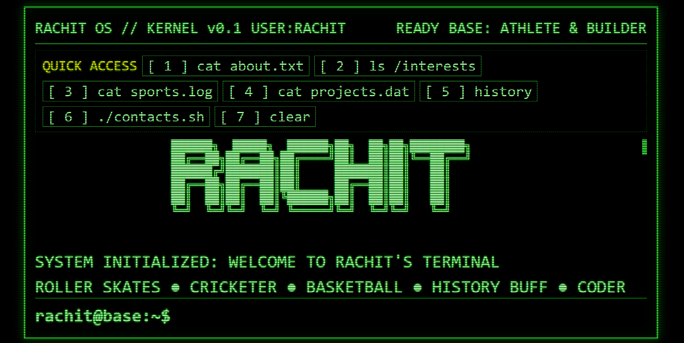
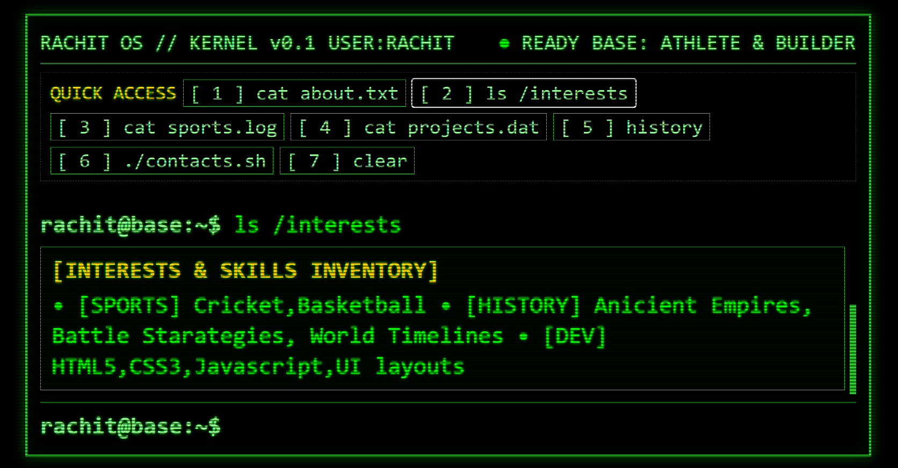

# Rachit OS // Cyberpunk CLI Portfolio

A personal developer portfolio built with the soul of a 1980s green-phosphor CRT mainframe. Designed with authentic scanline aesthetics, real-time 8-bit sound synthesis, monospaced typography, and a working interactive command-line interface.

Built for Rachit -- an 8th-grade student, multi-sport athlete (roller skating, cricket, basketball), ancient history enthusiast, and web builder.

---


## Features

- Retro CRT Aesthetics: Scanline raster overlay, phosphor glow (`text-shadow`), custom monospace typography via the `VT323` font, and hard-edged cyber frames.
- Two Ways to Navigate: Type raw terminal commands into the interactive prompt (`rachit@base:~$`) or click the quick-access chips pinned at the top.
- Zero-Asset 8-Bit Audio: Synthesizes classic arcade bleeps, execution chimes, and error tones in real time using the browser's native Web Audio API -- no external audio files required.
- Command History: Remembers past commands with Up Arrow and Down Arrow navigation, mirroring an authentic terminal experience.
- Interactive Project Dossiers: Formatted cards displaying application workflows, role responsibilities (applicant vs. recruiter), and clickable repository links.
- In-Terminal Contact Wizard: Type `./contacts.sh` to trigger a 3-step interactive message transmission protocol right inside the CLI output buffer.

---


## Available Commands

| Command |
| :--- | :--- |
| `cat about.txt` | Displays operator profile, background, and personal philosophy |
| `ls /interests` | Lists athletic disciplines, historical focus areas, and developer skills |
| `cat sports.log` | Deep dive into roller skating, cricket, and basketball metrics |
| `cat projects.dat` | Architectural breakdown of the two-sided Job & Recruiter platform |
| `history` | Research log covering classical empires and decisive battle tactics |
| `./contacts.sh` | Launches the interactive direct-dispatch transmission wizard |
| `clear` | Flushes the active output buffer |
| `help` | Prints the full list of available system commands |

Aliases like `projects`, `sports`, `about`, and `contact` also work directly.

---


## Tech Stack

- HTML5: Semantic architecture, ASCII art header containers, and retro HUD layout.
- CSS3: Custom phosphor CSS variables, scanline gradient masks, flexbox HUD headers, and CSS grid role cards.
- Vanilla JavaScript (ES6+): Pure DOM manipulation, state machines for wizard modes, arrow-key history buffers, and native `AudioContext` sound generation.

---

## Getting Started

No build steps, package managers, or frameworks required. Run it anywhere with a modern web browser.

## What I Learned

- Built custom terminal layouts.
- Handled keyboard arrow events.
- Created sounds without files.
- Kept previous command history.
- Managed user input steps.
- Fixed tricky JavaScript typos.
- Synced styles with code.

### 1. Clone the repository
```bash
git clone [https://github.com/ashutoshtiwa2007/Portfolio.git](https://github.com/ashutoshtiwa2007/Portfolio.git)
cd Portfolio

