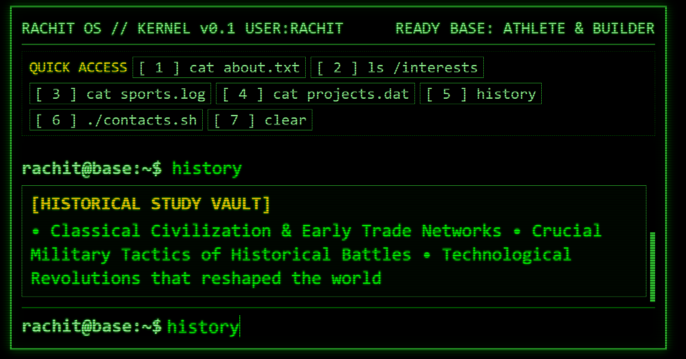

# Portfolio

* this is my porfolio based on a old green cli ui design
* this is made as a attempt to learn js calling and putting things into the html file and also how to add sound 

* this is the front or the start page of the web page where i basically decribe my self 

* you can either click on each button at the top to look at the info given in each tab

* Or you can write the command at the top to navigate through the webpage just like any linux terminal
* it also has a help command to get all available commands.

i have a project page it has anchored links for github but they dont run currently sorry for that