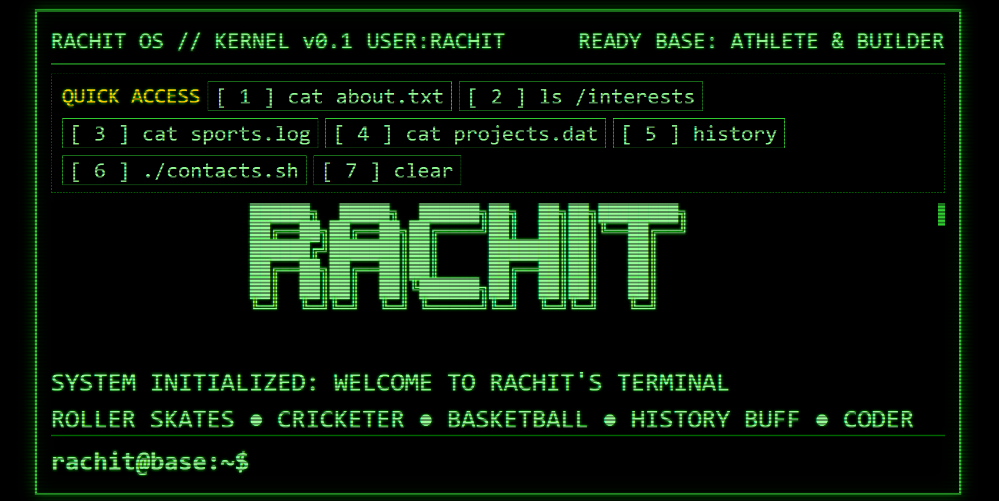
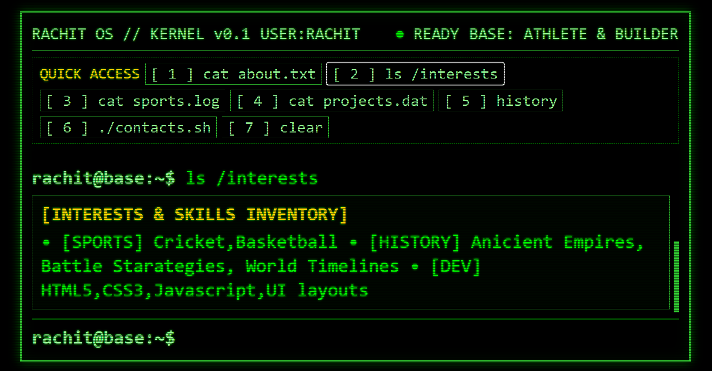

# Rachit OS // Cyberpunk CLI Portfolio

A 8 bit game inspired UI design portfolio inspired from old gameboy games and also to take a feel of hacker

Built for Rachit --  athlete (roller skating, cricket, basketball), ancient history enthusiast, and web builder.



## Features

- Retro Aesthetics: A hacker like green and black CLI 
- Audio: background and click sound that is inspired from 8 bit games on gameboy.
- Keys: UP/DOWN keys that actually remember last typed commands.
- Alias: like `projects`, `sports`, `about`, and `contact` also work directly.
- contact: A 3 process to contact me that actually dont work please note it doesnt work made to look cool and also addded a note in the real world to  make you know this

---


## Commands
| Cmd | About |
| :--- | :--- |
| `cat about.txt` | Displays about me and my name in big capital letters looks cool |
| `ls /interests` | My interests mentioned to look cool |
| `cat sports.log` |  roller skating, cricket, and basketball |
| `cat projects.dat` | A simple project that is under dev |
| `history` | my interest in history |
| `./contacts.sh` | Launches the interactive direct-dispatch transmission wizard , just a dummy not fully functional currently|
| `clear` | clears everything |
| `help` | list of useful commands |




## Tech Stack

- HTML5: Retro CLI layout and hacker like feel.
- CSS3: Custom phosphor CSS variables, gradients, flexboard, grid
- Vanilla JavaScript (ES6+):DOM, audio, UP/DOWN key rememberence, button and command responses


## Getting Started

Just a static webpage where i introduce my self in a cool hacker like manner. Works on any modern browser just by running the html file.

## What I Learned

- Built custom terminal layouts.
- Handled keyboard arrow events.
- Created sounds without files.
- Kept previous command history.
- Managed user input steps.
- Fixed tricky JavaScript typos.
- Synced styles with code.

### 1. Clone the repository
```bash
git clone https://github.com/ashutoshtiwa2007/Portfolio.git
cd Portfolio
```

